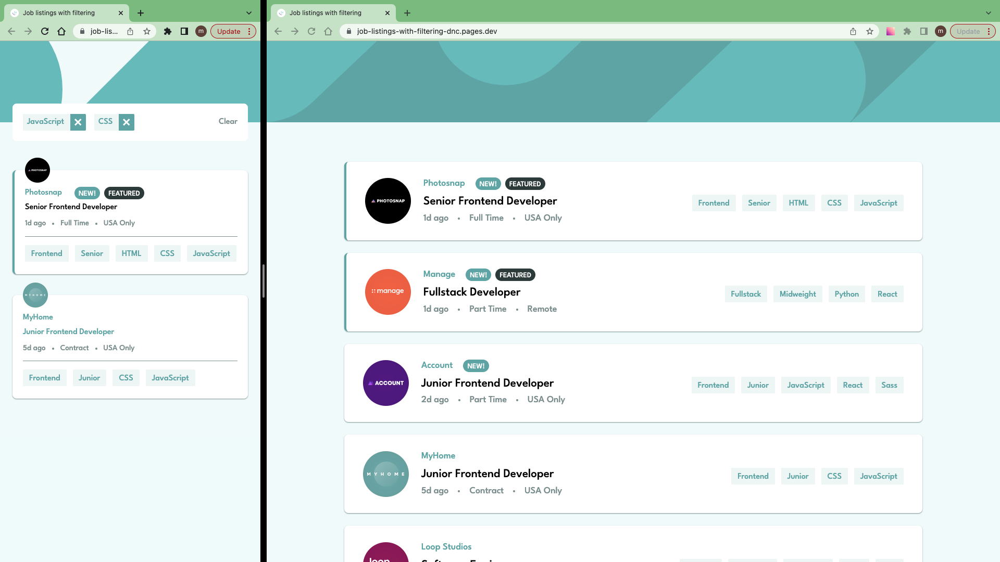

# Frontend Mentor - Job listings with filtering solution

This is a solution to the [Job listings with filtering challenge on Frontend Mentor](https://www.frontendmentor.io/challenges/job-listings-with-filtering-ivstIPCt).

## Table of contents

- [Overview](#overview)
  - [The challenge](#the-challenge)
  - [Screenshot](#screenshot)
  - [Links](#links)
- [My process](#my-process)
  - [Work time](#work-time)
  - [Built with](#built-with)
  - [Useful resources](#useful-resources)
- [Author](#author)
- [Acknowledgments](#acknowledgments)

## Overview

### The challenge

Users should be able to:

- View the optimal layout for the site depending on their device's screen size
- See hover states for all interactive elements on the page
- Filter job listings based on the categories

### Screenshot

### Links

- Solution: [frontendmentor.io](https://www.frontendmentor.io/solutions/job-listings-with-filtering-i8sZPjL7qz)

- Live Site: [cloudflare](https://job-listings-with-filtering-dnc.pages.dev/)

## My process

- 1.Download assets, Install Vite & TailwindCss, Initialize git, README.md, Prepare project, ...
- 2.Create components
  - 1.Identify component
  - 2.Create components + style + functionality if exists
  - 3.go to step 1 (Identify component)
- 3.Prepare and Publish(Write README.md, Push to github, Make it live on Cloudflare, Publish to frontendmentor, ...)

### Work Time

- [My Clockify Report](https://app.clockify.me/shared/648d9b05e2ea6d79e25312ce)

### Built with

- [React](https://react.dev/)
- [TailwindCss](https://tailwindcss.com/)
- [Framer Motion](https://framer.com/motion)

### Useful resources

- [Check if an array contains any element of another array](https://stackoverflow.com/a/57026309)

## Author

- Frontend Mentor - [@siavhnz](https://www.frontendmentor.io/profile/siavhnz)

- github - [@siavhnz](https://www.github.com/siavhnz)

## Acknowledgments

Thanks To

[Frontendmentor.io](https://www.frontendmentor.io/challenges) - for their Excitement challenges  

[Perfect Pixel](https://chrome.google.com/webstore/detail/perfectpixel-by-welldonec/dkaagdgjmgdmbnecmcefdhjekcoceebi?hl=en) - for such a great extension
